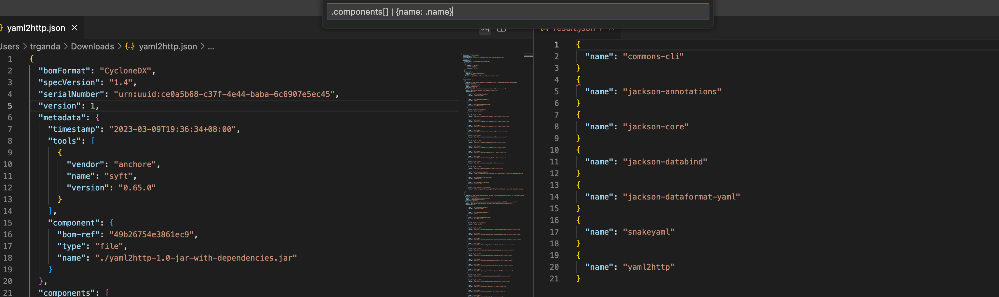
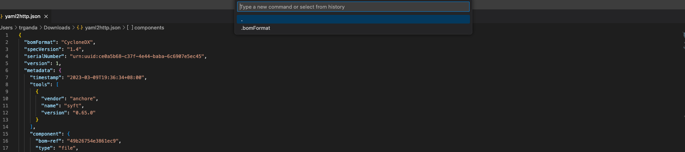

# jq-live

jq live is a vscode extension for using jq to query json file.

## Usage

Live query with [jq](https://stedolan.github.io/jq) query tools. You can click the icon **Jq** right on the editor bar, or use the context menu. Otherwise, you can type the `cmd+shift+j/ctrl+shift+j` on mac/windows. 

history select

> After type the query in the input box, press the Enter to add the query to history. 

## Known Issues

none

## Release Notes

Users appreciate release notes as you update your extension.

### 0.1.0

Initial release of jq-live,

* live jq query

### 0.1.1

* add icon
* fix image of feature not showing

### 0.1.2

* add keybinding
